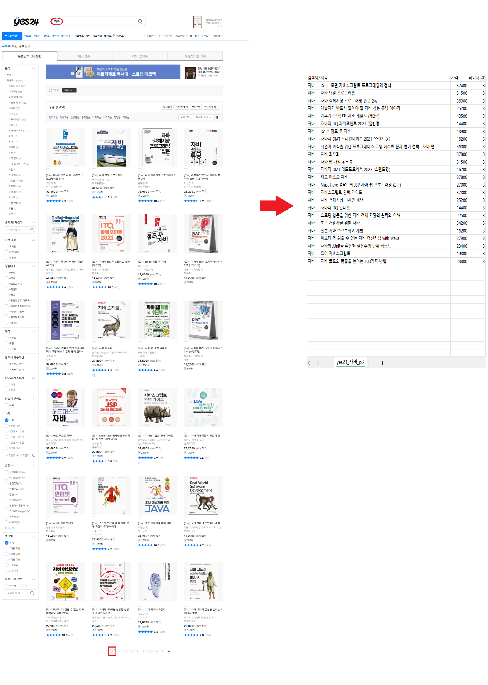

  

# 🔎 프로젝트 소개

YES24 키워드 검색결과 기반 크롤러 

YES24사이트에서 키워드로 일반도서를 검색했을 때 해당페이지의 상품 정보를 수집하고, CSV로 저장하며 증빙(HTML/PNG 스냅샷) 까지 자동으로 남기는 미니 크롤러입니다.

#### 주요 목표 
- ✅ 키워드·페이지 기반으로 YES24 도서 24건 단위 정확 수집
- ✅ 도서 전용 파라미터 고정으로 비도서(문구/음반/굿즈) 제외
- ✅ 중복 제거 및 가격 정제(숫자화) 후 CSV 저장으로 바로 활용 가능한 데이터셋 제공
- ✅ 실행 시 마지막 페이지 HTML/PNG 스냅샷 자동 저장 → 결과 재현/검증 강화

저부하·재현 가능한 수집 파이프라인을 제공하여, “수동 검색 → 엑셀 정리” 과정을 자동화하고 결과를 증빙 파일(HTML/PNG)과 함께 남깁니다. 이를 통해 데이터 수집 자동화 역량과 품질 검증·운영 안정성에 대한 이해를 보여줄 수 있습니다.

# 📆 개발 기간

#### 2025.09.29 ~ 2025.10.04

*   2025.09.29 ~ 2025.10.01 : 환경 셋업(venv, 의존성), 정적/동적 방식 비교
*   2025.10.02 : Selenium 전환, 도서 전용 URL 파라미터 확정
*   2025.10.03 : CSS 셀렉터 폴백, 페이지 단위 저장 구조 정리
*   2025.10.04 : 결과 검증 및 정리

# 👨‍💻 구현내용

*   수집 로직 설계
    - 키워드·페이지 기반 URL 생성:
    `?query={kw}&domain=BOOK&page={p}&size=24&viewMode=thumb`
    - URL 직접 모드(고정 URL 입력) 지원
*   안정화
    - 결과 블록 기준: `div.goods_info` → 제목: `.goods_name a`, 가격: `.goods_price em.yes_b`
    - 셀렉터 폴백, 짧은 대기(sleep(0.5s))로 저부하·재현성 확보
*   데이터 정제/저장
    - (제목, 가격) 중복 제거, 가격 숫자 변환 → CSV(검색어/URL, 제목, 가격, 페이지)
    - 실행 시 마지막 페이지 HTML/PNG 스냅샷 자동 저장
*   검증
    - `size=24, viewMode=thumb` 동일 조건에서 수동 페이지와 1:1 대조(24건 일치 확인)
*   문서화
    - README에 스크린샷, 실행 로그, 결과 CSV 샘플 반영  

# ⚙️ 개발 환경

*   OS : Windows10
*   IDE : VS Code
*   Python : 3.10+

# 🛠️ 기술 스택 & 사용 라이브러리

### 🖥️ Front-End

*   HTML 구조 파악, CSS Selector

### ⚙️ Back-End(크롤링)

*   Python, Selenium, webdriver-manager

# 📸 프로젝트 구현

*   실행 로그

  

*   yes24페이지 & CSV 결과(24건)

  

